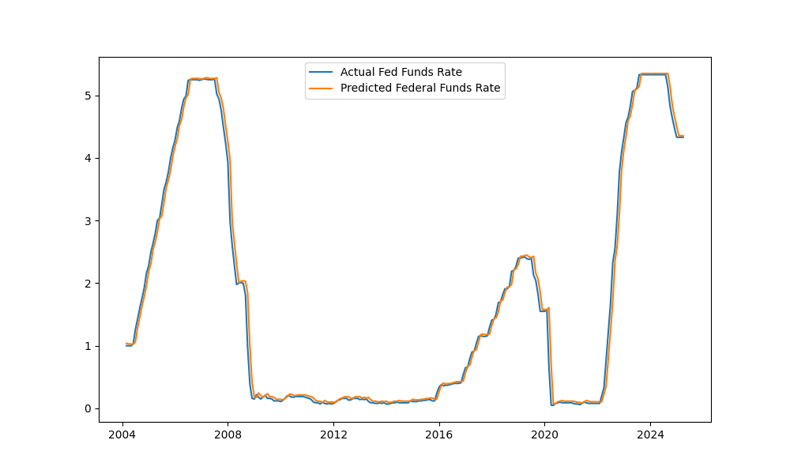

### Forecasting Federal Fund's Rate

I used the Fred Api token to gain access to to the series data titled "FEDFUNDS". This is a pretty similar forecast compared to all of the other LSTM, torch forecasts. You need the Api key from Fred to gain access to their data. This is a forecast of the Federal Funds Rate.

### Requirements
```bash
pip install fredapi torch torchvision torchaudio numpy pandas sciki-learn matplotlib seaborn
```
Make Sure, if you ever use Fred for data, to hide your Api key from the public. Put it in a .gitignore file or something else. Make sure it is not publicly available.

### Accessing Data from Fred
When you get access to your Api key, make a .env file or a package to hide the token id.
```python

fred = fr.Fred(fred_api_key)


device = "cuda:0" if torch.cuda.is_available() else "cpu"
print(device)

"""Interest Rates(Fed Funds Rate) """

ffr = fred.get_series("FEDFUNDS")
ffr.name = "Fed Funds Rate"

data = pd.DataFrame(ffr).dropna()
```
When you name series data, you first have to use your Api via "fredapi" in python(if you are using python). Then, put it in a dataframe and the rest goes as usual.

### Structure
This will be setup pretty much the same as most timeseries LSTM's via torch.
```python
training = data.iloc[:,0:1].values


train_split = int(len(training) * .70)

train_data = training[:train_split]
test_data = training[train_split:]
train_data.shape
test_data.shape

scaler = MinMaxScaler()
train_data = scaler.fit_transform(train_data)
test_data = scaler.transform(test_data)

def slider(df, seq_length):
    X, y = [], []
    for i in range(len(df) - seq_length):
        X_ = df[i:(i + seq_length)]
        y_ = df[i + seq_length]
        X.append(X_)
        y.append(y_)
    return np.array(X), np.array(y)

seq_length = 5
X_train, y_train = slider(train_data, seq_length)
X_test,y_test = slider(test_data,seq_length)

X_train = torch.from_numpy(X_train).float()
y_train = torch.from_numpy(y_train).float()

X_test = torch.from_numpy(X_test).float()
y_test = torch.from_numpy(y_test).float()
```
I do not simply use "seq_length = 1" every single time I forecast. The only reason is that the train size for the split was very good to run 1000 epochs for the lstm and I did not see any harm

### results after training
```python
with torch.no_grad():
    pred = model(X_test)
    pred_np = pred.cpu().numpy()
    y_test_np = y_test.cpu().numpy()
    pred_rescaled = scaler.inverse_transform(pred_np)
    actual_rescaled = scaler.inverse_transform(y_test_np)


test_dates = data.iloc[train_split + seq_length:]['Date'].reset_index(drop=True)

comparison_df = pd.DataFrame({
    "Date": test_dates,
    "Actual Interest Rate": actual_rescaled.flatten(),
    "Predicted Interest Rate": pred_rescaled.flatten()
})

print(comparison_df.tail(20))
```

### Predicted Vs Actual Federal Fund's Rates

```text
Date  Actual Interest Rate  Predicted Interest Rate
0  2004-07-01                  1.26                 1.068696
1  2004-08-01                  1.43                 1.250661
2  2004-09-01                  1.61                 1.480882
3  2004-10-01                  1.76                 1.691145
4  2004-11-01                  1.93                 1.854098
5  2004-12-01                  2.16                 2.009102
6  2005-01-01                  2.28                 2.222731
7  2005-02-01                  2.50                 2.381438
8  2005-03-01                  2.63                 2.568926
9  2005-04-01                  2.79                 2.721629
10 2005-05-01                  3.00                 2.867101
11 2005-06-01                  3.04                 3.063556
12 2005-07-01                  3.26                 3.145798
13 2005-08-01                  3.50                 3.306505
14 2005-09-01                  3.62                 3.557008
15 2005-10-01                  3.78                 3.722946
16 2005-11-01                  4.00                 3.862746
17 2005-12-01                  4.16                 4.065329
18 2006-01-01                  4.29                 4.248698
19 2006-02-01                  4.49                 4.380292
          Date  Actual Interest Rate  Predicted Interest Rate
231 2023-10-01                  5.33                 5.419705
232 2023-11-01                  5.33                 5.391440
233 2023-12-01                  5.33                 5.373291
234 2024-01-01                  5.33                 5.369454
235 2024-02-01                  5.33                 5.369454
236 2024-03-01                  5.33                 5.369454
237 2024-04-01                  5.33                 5.369454
238 2024-05-01                  5.33                 5.369454
239 2024-06-01                  5.33                 5.369454
240 2024-07-01                  5.33                 5.369454
241 2024-08-01                  5.33                 5.369454
242 2024-09-01                  5.13                 5.369454
243 2024-10-01                  4.83                 5.181564
244 2024-11-01                  4.64                 4.843575
245 2024-12-01                  4.48                 4.602854
246 2025-01-01                  4.33                 4.448228
247 2025-02-01                  4.33                 4.311800
248 2025-03-01                  4.33                 4.304441
249 2025-04-01                  4.33                 4.339252
250 2025-05-01                  4.33                 4.358502
```




