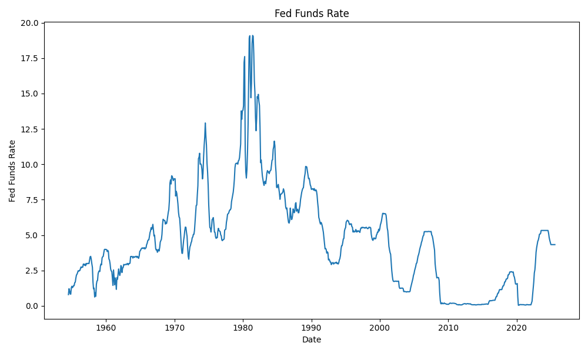

### Forecasting Fed Funds Rate Through Fred

### Requirements
```bash
pip install fredapi torch torchvision torchaudio numpy pandas sciki-learn matplotlib seaborn catboost xgboot-cpu mlflow
```





### Structure

```python


class BiLSTM(nn.Module):
    def __init__(self, input_size, hidden_size, num_layers, output_size):
        super(BiLSTM, self).__init__()
        self.input_size = input_size
        self.hidden_size = hidden_size
        self.num_layers = num_layers
        self.output_size = output_size
        self.lstm = nn.LSTM(input_size, hidden_size, num_layers, batch_first=True, bidirectional=True)
        self.fc = nn.Linear(hidden_size * 2, output_size)

    def forward(self, X):
        h0 = torch.zeros(2 * self.num_layers, X.size(0), self.hidden_size)
        c0 = torch.zeros(2 * self.num_layers, X.size(0), self.hidden_size)
        out, _ = self.lstm(X,(h0, c0))
        out = self.fc(out[:,-1,:])
        return out


bidirectional_lstm = BiLSTM(input_size=1,hidden_size=256,num_layers=2,output_size=1)
epochs = 500
learning_rate = 0.001
bilistm_optimizer = torch.optim.Adam(params=bidirectional_lstm.parameters(),lr=learning_rate)
loss_fn = nn.MSELoss()
```


### Predicted Vs Actual Fed Funds Rate

```text
Root Mean-Squared Error: 0.1664
R2 Score: 99.18
Mean Absolute Percentage Error: 0.4118
          Date  Actual Fed Funds Rate  Predicted Fed Funds Rate
684 2011-07-01                   0.07                  0.029438
685 2011-08-01                   0.10                  0.008798
686 2011-09-01                   0.08                  0.039758
687 2011-10-01                   0.07                  0.019119
688 2011-11-01                   0.08                  0.008798
689 2011-12-01                   0.07                  0.019119
690 2012-01-01                   0.08                  0.008798
691 2012-02-01                   0.10                  0.019119
692 2012-03-01                   0.13                  0.039758
693 2012-04-01                   0.14                  0.070713
694 2012-05-01                   0.16                  0.081031
695 2012-06-01                   0.16                  0.101665
696 2012-07-01                   0.16                  0.101665
697 2012-08-01                   0.13                  0.101665
698 2012-09-01                   0.14                  0.070713
699 2012-10-01                   0.16                  0.081031
700 2012-11-01                   0.16                  0.101665
701 2012-12-01                   0.16                  0.101665
702 2013-01-01                   0.14                  0.101665
703 2013-02-01                   0.15                  0.081031
          Date  Actual Fed Funds Rate  Predicted Fed Funds Rate
834 2024-01-01               5.329999                  5.368277
835 2024-02-01               5.329999                  5.368277
836 2024-03-01               5.329999                  5.368277
837 2024-04-01               5.329999                  5.368277
838 2024-05-01               5.329999                  5.368277
839 2024-06-01               5.329999                  5.368277
840 2024-07-01               5.329999                  5.368277
841 2024-08-01               5.329999                  5.368277
842 2024-09-01               5.130000                  5.368277
843 2024-10-01               4.830000                  5.167371
844 2024-11-01               4.640000                  4.865542
845 2024-12-01               4.480000                  4.674095
846 2025-01-01               4.330000                  4.512704
847 2025-02-01               4.330000                  4.361259
848 2025-03-01               4.330000                  4.361259
849 2025-04-01               4.330000                  4.361259
850 2025-05-01               4.330000                  4.361259
851 2025-06-01               4.330000                  4.361259
852 2025-07-01               4.330000                  4.361259
853 2025-08-01               4.330000                  4.361259
```


### Predicted VS Actual Fed Funds Rate using Random Forest

```text
Root Mean-Squared Error: 0.2901
R2 Score: 99.13%
Mean Absolute Percentage Error: 0.0547
Predicted Vs Actual Prices

     Actual  Predicted
23     2.71     2.7398
30     2.84     2.9392
31     3.00     2.9492
33     3.00     2.9828
39     3.50     3.3926
49     1.53     1.4418
63     3.98     3.7952
65     3.99     3.9240
66     3.99     3.8928
67     3.97     3.8640
72     3.23     3.2852
76     2.44     2.5578
77     1.98     2.4798
78     1.45     2.4028
86     1.88     2.2176
96     2.71     2.6938
109    3.49     3.0692
110    3.48     3.4350
120    3.42     3.4984
136    4.10     4.1158
     Actual  Predicted
706    0.11     0.1356
709    0.08     0.0874
713    0.09     0.0784
733    0.14     0.1352
740    0.36     0.3732
746    0.40     0.4002
753    0.90     0.8714
767    1.82     1.8598
778    2.39     2.4036
788    0.65     1.1174
792    0.09     0.0808
802    0.06     0.0752
808    0.08     0.0804
819    3.08     2.8162
830    5.33     5.3216
833    5.33     5.3300
835    5.33     5.3300
840    5.33     5.3180
849    4.33     4.3300
850    4.33     4.3300
```


