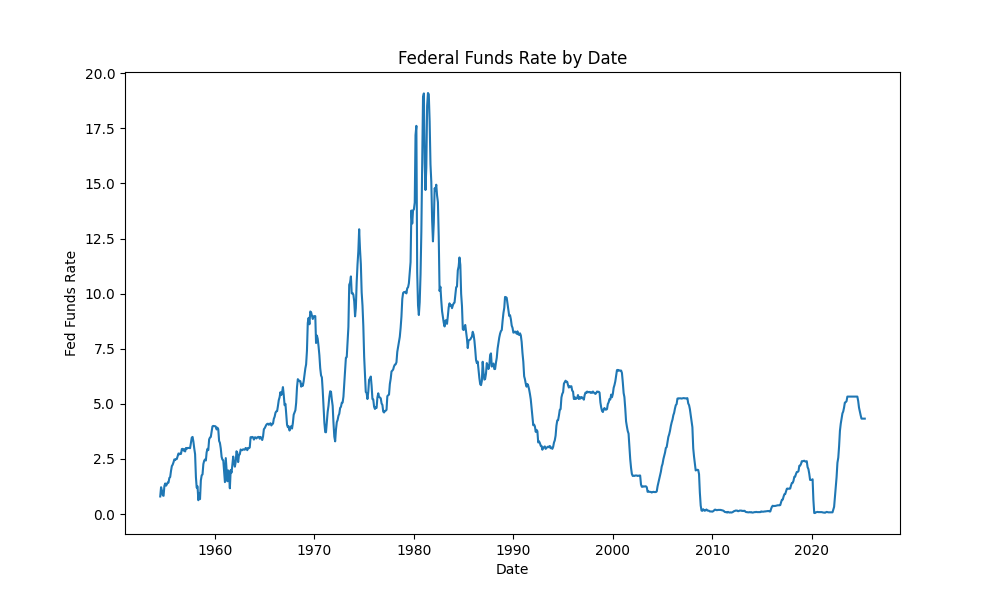
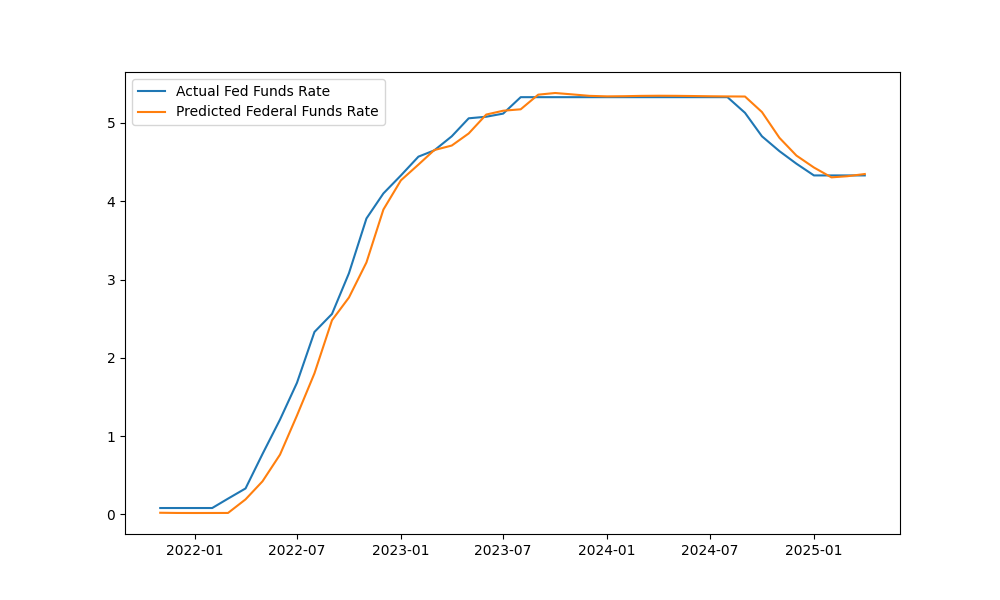

### Forecasting Federal Fund's Rate

I used the Fred Api token to gain access to to the series data titled "FEDFUNDS". This is a pretty similar forecast compared to all of the other LSTM, torch forecasts. You need the Api key from Fred to gain access to their data. This is a forecast of the Federal Funds Rate.

### Requirements
```bash
pip install fredapi torch torchvision torchaudio numpy pandas sciki-learn matplotlib seaborn catboost xgboot-cpu mlflow
```
Make Sure, if you ever use Fred for data, to hide your Api key from the public. Put it in a .gitignore file or something else. Make sure it is not publicly available.

### Accessing Data from Fred
When you get access to your Api key, make a .env file or a package to hide the token id.
```python

fred = fr.Fred(fred_api_key)


device = "cuda:0" if torch.cuda.is_available() else "cpu"
print(device)

"""Interest Rates(Fed Funds Rate) """

ffr = fred.get_series("FEDFUNDS")
ffr.name = "Fed Funds Rate"

data = pd.DataFrame(ffr).dropna()
```
When you name series data, you first have to use your Api via "fredapi" in python(if you are using python). Then, put it in a dataframe and the rest goes as usual.





### Structure
This will be setup pretty much the same as most timeseries LSTM's via torch.
```python

data.dropna(inplace=True)
training = data.iloc[:,0:1].values


train_split = int(len(training) * .88)
train_data = training[:train_split]
test_data = training[train_split:]
print(f' Shape of training data: {train_data.shape}')
print(f' Shape of testing data: {test_data.shape}')

scaler = MinMaxScaler()
train_data = scaler.fit_transform(train_data)
test_data = scaler.transform(test_data)

def slider(dataframe, seq_length):
    X, y = [], []
    for i in range(len(dataframe) - seq_length):
        X_ = dataframe[i:(i + seq_length)]
        y_ = dataframe[i + seq_length]
        X.append(X_)
        y.append(y_)
    return np.array(X), np.array(y)

seq_length = 12

X_train, y_train = slider(train_data, seq_length)
X_test,y_test = slider(test_data,seq_length)


X_train = torch.from_numpy(X_train).float()
y_train = torch.from_numpy(y_train).float()

X_test = torch.from_numpy(X_test).float()
y_test = torch.from_numpy(y_test).float()


class BiLSTM(nn.Module):
    def __init__(self, input_size, hidden_size, num_layers, output_size):
        super(BiLSTM, self).__init__()
        self.input_size = input_size
        self.hidden_size = hidden_size
        self.num_layers = num_layers
        self.output_size = output_size
        self.lstm = nn.LSTM(input_size, hidden_size, num_layers, batch_first=True, bidirectional=True)
        self.fc = nn.Linear(hidden_size * 2, output_size)

    def forward(self, X):
        h0 = torch.zeros(2 * self.num_layers, X.size(0), self.hidden_size)
        c0 = torch.zeros(2 * self.num_layers, X.size(0), self.hidden_size)
        out, _ = self.lstm(X,(h0, c0))
        out = self.fc(out[:,-1,:])
        return out


bidirectional_lstm = BiLSTM(input_size=1,hidden_size=128,num_layers=2,output_size=1)
epochs = 500
learning_rate = 0.001
bilistm_optimizer = torch.optim.Adam(params=bidirectional_lstm.parameters(),lr=learning_rate)
loss_fn = nn.MSELoss()
```


### Predicted Vs Actual Fed Funds Rate (BiLSTM)

```text
Root Mean Squared Error: 0.0107
R2 Score: 98.93%
 Date  Actual Fed Funds Rate  Predicted Fed Funds Rate
761 2017-12-01                   1.30                  1.220817
762 2018-01-01                   1.41                  1.335365
763 2018-02-01                   1.42                  1.454454
764 2018-03-01                   1.51                  1.490311
765 2018-04-01                   1.69                  1.569176
766 2018-05-01                   1.70                  1.732006
767 2018-06-01                   1.82                  1.771627
768 2018-07-01                   1.91                  1.873607
769 2018-08-01                   1.91                  1.963096
770 2018-09-01                   1.95                  1.974071
771 2018-10-01                   2.19                  2.000722
772 2018-11-01                   2.20                  2.204244
773 2018-12-01                   2.27                  2.254131
774 2019-01-01                   2.40                  2.317508
775 2019-02-01                   2.40                  2.432501
776 2019-03-01                   2.41                  2.448006
777 2019-04-01                   2.42                  2.449847
778 2019-05-01                   2.39                  2.449577
779 2019-06-01                   2.38                  2.417841
780 2019-07-01                   2.40                  2.399379
          Date  Actual Fed Funds Rate  Predicted Fed Funds Rate
832 2023-11-01                   5.33                  5.360042
833 2023-12-01                   5.33                  5.346322
834 2024-01-01                   5.33                  5.338457
835 2024-02-01                   5.33                  5.335941
836 2024-03-01                   5.33                  5.336048
837 2024-04-01                   5.33                  5.337097
838 2024-05-01                   5.33                  5.338124
839 2024-06-01                   5.33                  5.338805
840 2024-07-01                   5.33                  5.339211
841 2024-08-01                   5.33                  5.339392
842 2024-09-01                   5.13                  5.339392
843 2024-10-01                   4.83                  5.147236
844 2024-11-01                   4.64                  4.823328
845 2024-12-01                   4.48                  4.588309
846 2025-01-01                   4.33                  4.414517
847 2025-02-01                   4.33                  4.269219
848 2025-03-01                   4.33                  4.268806
849 2025-04-01                   4.33                  4.293983
850 2025-05-01                   4.33                  4.315125
851 2025-06-01                   4.33                  4.325586
```



### Predicted VS Actual Fed Funds Rate using RandomForest

```text
Predicted Vs Actual Fed Funds Rate

     Actual  Predicted
5      1.28    0.93660
7      1.29    1.35300
10     1.43    1.48950
23     2.71    2.73705
29     2.94    2.90800
..      ...        ...
835    5.33    5.33000
838    5.33    5.33000
847    4.33    4.36855
848    4.33    4.35925
850    4.33    4.34725

[171 rows x 2 columns]
    Actual  Predicted
5     1.28    0.93660
7     1.29    1.35300
10    1.43    1.48950
23    2.71    2.73705
29    2.94    2.90800
30    2.84    2.94405
31    3.00    2.96380
33    3.00    2.99120
39    3.50    3.38165
49    1.53    1.49535
54    2.48    2.44325
63    3.98    3.77050
65    3.99    3.88970
66    3.99    3.87935
67    3.97    3.86185
72    3.23    3.26270
76    2.44    2.52375
77    1.98    2.44045
78    1.45    2.35585
81    1.49    2.03595
     Actual  Predicted
744    0.39    0.38405
750    0.65    0.60150
751    0.66    0.80325
765    1.69    1.62735
767    1.82    1.85045
773    2.27    2.24560
786    1.55    1.49260
792    0.09    0.08960
800    0.07    0.07730
804    0.10    0.08040
806    0.08    0.08220
815    1.21    0.83275
816    1.68    1.82865
818    2.56    2.96185
828    5.12    5.13185
835    5.33    5.33000
838    5.33    5.33000
847    4.33    4.36855
848    4.33    4.35925
850    4.33    4.34725
```


