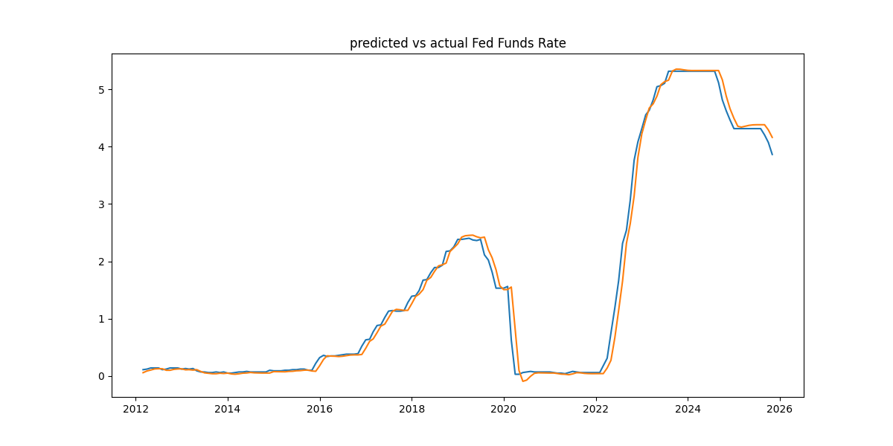

### Forecasting Fed Funds Rate Through Fred API





- Predicted Vs Actual Fed Funds Rate

```text
Dates:                   Actual Fed Funds Rate  Predicted Fed Funds Rate
692 2012-03-01               0.110063                  0.057684
693 2012-04-01               0.120074                  0.087483
694 2012-05-01               0.140095                  0.103746
695 2012-06-01               0.140095                  0.123031
696 2012-07-01               0.140095                  0.126576
697 2012-08-01               0.110063                  0.125712
698 2012-09-01               0.120074                  0.099807
699 2012-10-01               0.140095                  0.099596
700 2012-11-01               0.140095                  0.116366
701 2012-12-01               0.140095                  0.122538
702 2013-01-01               0.120074                  0.124325
703 2013-02-01               0.130084                  0.107741
704 2013-03-01               0.120074                  0.110127
705 2013-04-01               0.130084                  0.103075
706 2013-05-01               0.090042                  0.109762
707 2013-06-01               0.070021                  0.079763
708 2013-07-01               0.070021                  0.054654
709 2013-08-01               0.060011                  0.047808
710 2013-09-01               0.060011                  0.039724
711 2013-10-01               0.070021                  0.039209
Dates                        Actual Fed Funds Rate     Predicted Fed Funds Rate
837 2024-04-01               5.315527                  5.327871
838 2024-05-01               5.315527                  5.327871
839 2024-06-01               5.315527                  5.327871
840 2024-07-01               5.315527                  5.327871
841 2024-08-01               5.315527                  5.327871
842 2024-09-01               5.115318                  5.327871
843 2024-10-01               4.815002                  5.165352
844 2024-11-01               4.624803                  4.881145
845 2024-12-01               4.464635                  4.661305
846 2025-01-01               4.314477                  4.494381
847 2025-02-01               4.314477                  4.354619
848 2025-03-01               4.314477                  4.340764
849 2025-04-01               4.314477                  4.355843
850 2025-05-01               4.314477                  4.371361
851 2025-06-01               4.314477                  4.379821
852 2025-07-01               4.314477                  4.382254
853 2025-08-01               4.314477                  4.382201
854 2025-09-01               4.204361                  4.382201
855 2025-10-01               4.074225                  4.292371
856 2025-11-01               3.864004                  4.161546
```


